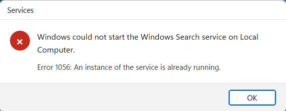
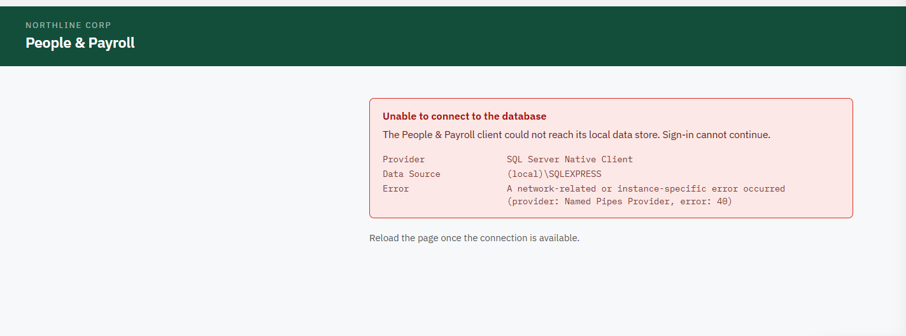
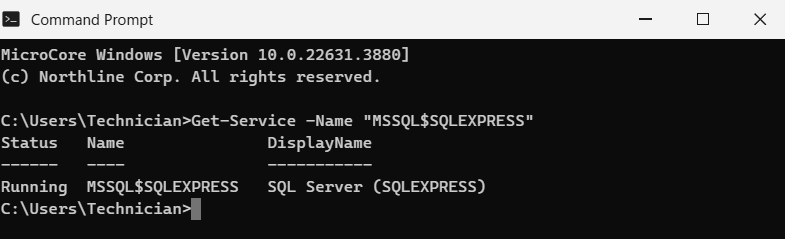
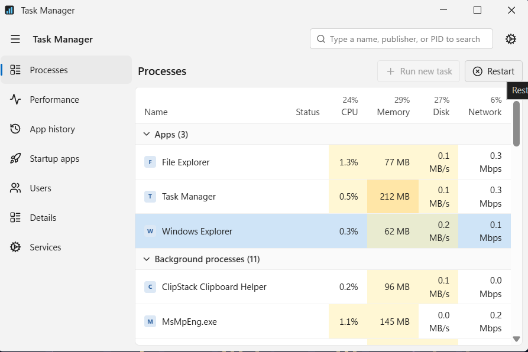

## This is my practice place as an SysAdmin
-----------------1-------------------------
1. ## Description:

Last week an ad popped up offering to speed up my laptop, so I ran PC Speed Booster Pro and let it 'optimize' everything. It does feel a bit quicker, but now I can't print at all — Word says the printer isn't available and the printers in Settings all show as offline. I need to print contracts this afternoon.

2. ## Resolution

2.1. Start Print Spooler service
- Spooler is the service that queues and routes print jobs, so while it is stopped nothing prints and queue can't even opened, let alone cleared. Every printer reading Offline at Once - software printers included - is the signature of the service being down rather than of any device being unplugged.

2.2. Set the spooler service's type to Automatic

2.3. Close and update ticket for client
-----------------2-------------------------
1. ## Description:

Since the firewall change last night nobody in the office can get to any website. Email still comes in and out and the internal systems are fine. Whoever did the work has gone on leave.

2. ## Resolution:

We need to clarify that the issue is internal user can't access any website out of it VLAN. This issue might be related to Router which will forward traffic in different network (private -> public).

In the access rules of Router, there is disabled rule (VLAN -> WAN). This is reason why users inside company could not browse any websites. I enable it and it is working fine now.

---------3-------------------------------------
1. ## Description:

Hi, this is Aisha. My coworker was trying to sort out my search not finding things and typed something in one of those black command windows. A gray error box came up and he had to go, so I've left it on the screen exactly as it was. I don't know if that means it worked or if something's still broken — can you look?

2. ## Resolution 

Upon my checking, the Error means "An instance already running so we couldn't start service twice." There is no any wrong with that. I have check the service status by command line, and it returns me running status of that one. Everything works perfectly.

---------4----------------------------------------

1. ## Description:

Hi, this is Elena in Operations. The HR portal won't come up on my PC. It gets as far as the login screen and then throws an error about not being able to reach the database. I asked two people on my team and it's working fine for them, so I don't think it's the system itself — it's just mine. I need to get timesheets approved today.

2. ## Resolution 

The SQL service was stopped caused to unable to connect to the database. I started via CLI and now it is running and you can access HR portal as well.

-------5--------------------------

1. ## Description:

Hi, Devon here. Copy and paste has just stopped on my PC. Ctrl+C does nothing, right-click Copy does nothing, and it's the same in every program — the spreadsheet, the browser, even dragging text between two folders. I've been retyping stock numbers by hand all morning. I haven't installed anything new that I know of.

2. ## Resolution 
2.1 Restart Window Explorer to rebuild the clipboard

3. ## Root cause
The clipboard chain on this machine is wedged — a clipboard-history helper Devon picked up at some point has hold of it and is not letting go. That is why it fails identically in every program: copy and paste are not app features, they are shell features, so when the shell's clipboard breaks, everything breaks at once. The fix is the standard one and it is on this machine, not in the directory and not in any app: open Task Manager, select Windows Explorer, and click Restart — the button says Restart rather than End task, because ending the shell outright would leave him with no desktop. Restarting rebuilds the shell and the clipboard chain with it. Reproduce the fault first in File Explorer (select a file, Copy is dead), restart the shell, then copy and paste something in front of him so he can see it working before you close.